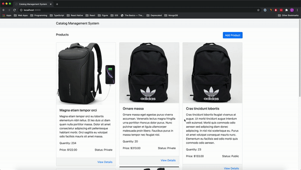

# Product Catalog Management System

> 🏬 Web application that helps users manage product listings. Implements create, read and update and delete products.

## Demo



## Client

Built with Next.js and React Bootstrap.

Environment config is located at `next.config.js`

Set up and run 

```
cd client 

npm i

npm run build

npm run start
```

View app at http://localhost:3000

Run tests

```
npm test
```


## Server

Built with NestJS, MongoDB and Mongoose.

Install and run MongoDB - https://zellwk.com/blog/install-mongodb/

Add `.env` file referencing `.env.example`

Start server

```
cd server 

npm i

npm start
```

Healthcheck endpoint is at `/api/health`

Run e2e tests

```
npm run start:dev

npm run test:e2e
```

## Todos

- [ ] Add authentication
- [ ] Add create, update, delete product UI integration tests
- [ ] Add list products pagination
- [ ] Add search, sort, filter products


